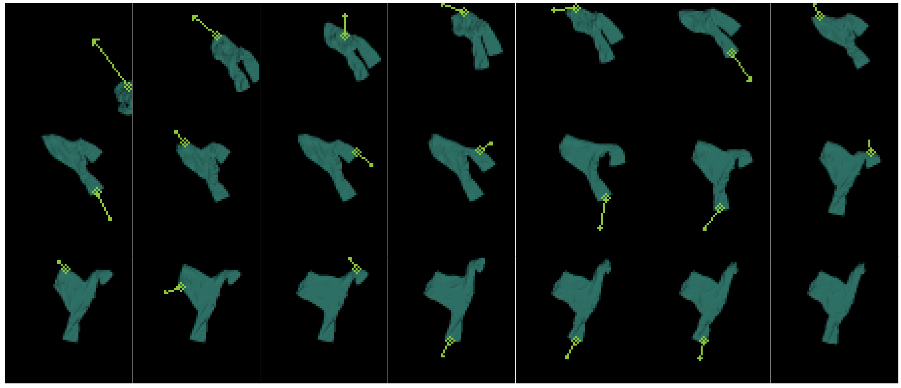
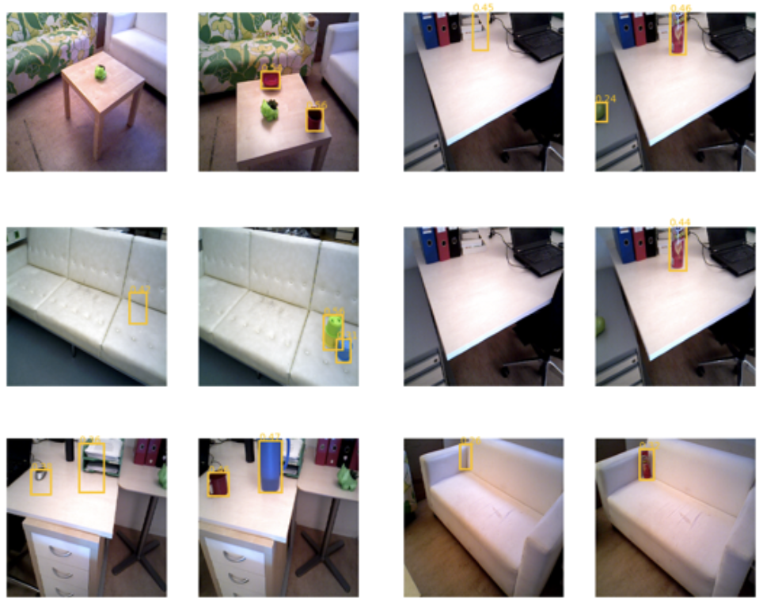
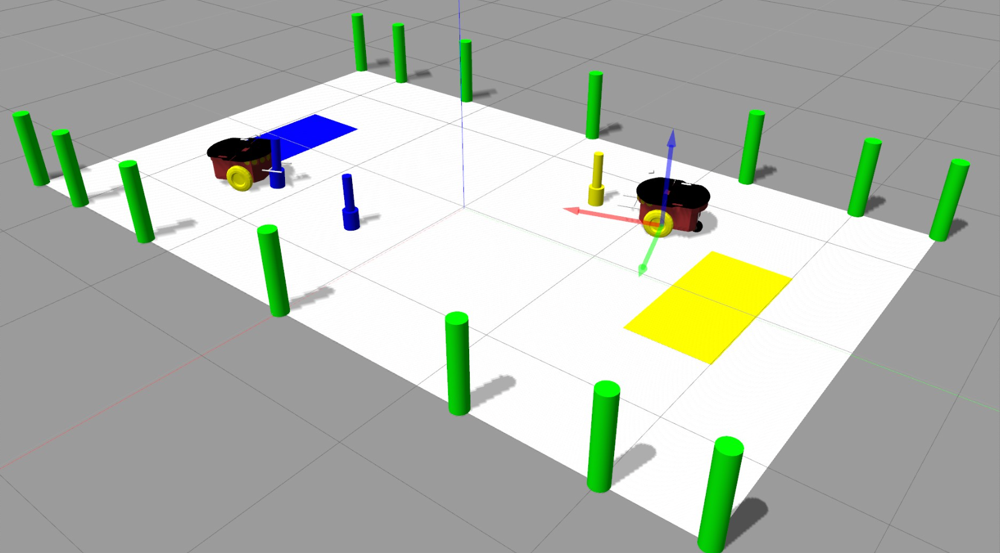
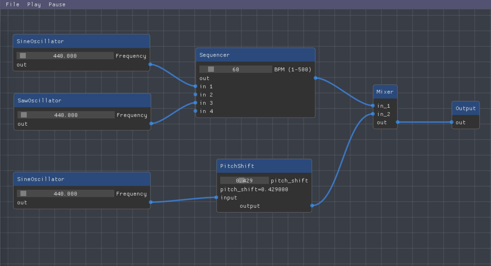
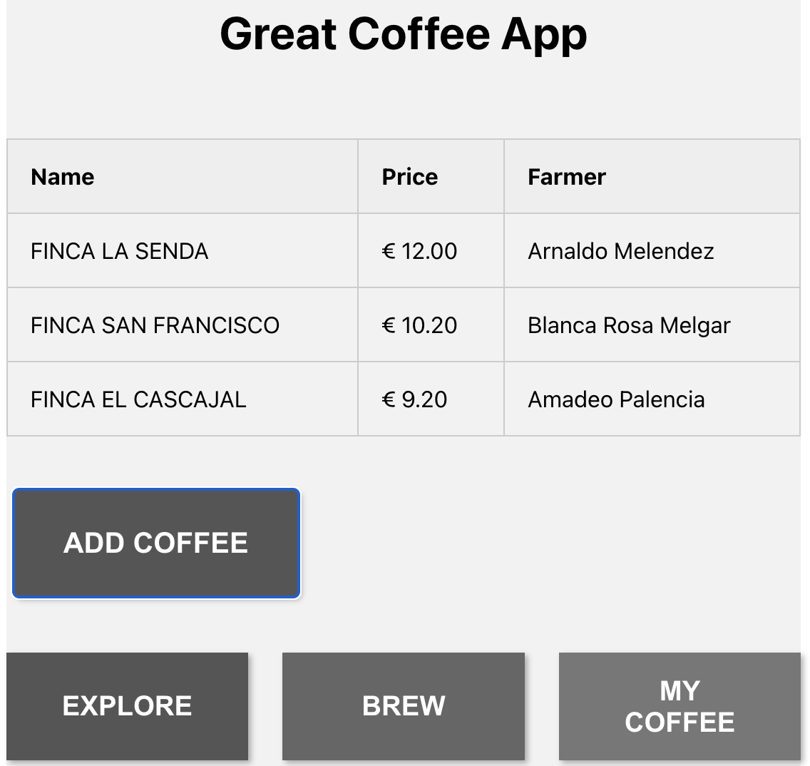

## Hi there, I'm Florian Pfleiderer!

<p><em>
I hold a Master’s Degree with Distinction in Computer Science from the 
<a href="https://www.st-andrews.ac.uk/">University of St Andrews</a>, 
where I focused on machine learning, multi-core programming, and data-intensive systems. 
My master’s thesis centered on model-based reinforcement learning, exploring sample-efficient methods for decision-making and control in dynamic environments. <br>
During my undergraduate degree in Electrical Engineering and Communication Technologies at the 
<a href="https://www.tuwien.at/en/">Technical University of Vienna</a>, 
I ranked among the top 15% of my cohort while following an individual study plan with a strong emphasis on Robotics, Machine Vision, and Automation. <br>
I was also part of <a href="https://www.tuwienracing.at/">TU Wien Racing</a>, where I led embedded software development for the racecar’s electronic control unit and contributed to securing a top-25 place among over 200 international teams. <br>
My interests lie in applied AI, reinforcement learning, and robotics, with a focus on building intelligent and impactful autonomous systems.
</em></p>


[](https://www.linkedin.com/in/florian-pfleiderer/)
[](https://github.com/florianpfleiderer)
[](https://florianpfleiderer.at/)


### 🔭 I'm currently working on ...

- experimenting with ROS2
- learning rust

<!--  -->

### 🌱 My best projects ...

- **[Transformer-based World Model for Cloth Manipulation](https://github.com/florianpfleiderer/TSSAgent)** - *Deep RL · Control · Manipulation*  

  Implementation of a **Transformer-based state-space model (TSSM)** for robotic cloth manipulation. The agent learns **latent world models** from fabric manipulation datasets and uses **model-predictive control** for planning. Built on the **Agent-Arena** framework for training, evaluation, and benchmarking of world-model agents on cloth flattening and other deformable-object tasks.

- **[Improved Change Detection in Autonomous Systems](https://github.com/florianpfleiderer/CYWS3D-pipeline)** – *ROS · DINO-ViT · Perception*  

  Integration of the **CYWS-3D** model into an indoor mobile robotics research project to enhance visual change detection. Combines **DINO-pretrained Vision Transformers** for feature extraction, **SuperGlue** GNNs for correspondence matching, and **UNet-SCSE** modules for spatial reasoning. Uses **CenterNet** detection with differentiable 3D warping to bypass traditional reconstruction pipelines, improving occlusion handling and geometric registration for unsupervised home-assistance scenarios.

- **[Autonomous Robot Hockey System](https://github.com/florianpfleiderer/ARHS)** – *ROS · Sensor Fusion · Navigation*  

  A **ROS-based multi-robot system** enabling autonomous hockey-style gameplay. Implements **LiDAR + Kinect** sensor fusion for perception and **potential-field motion planning** for real-time navigation and obstacle avoidance. Features a **state-machine architecture** supporting team coordination, dynamic target selection, puck manipulation, and goal-scoring behavior on physical robots.


- **[SimpleSynth — Digital Modular Synthesizer](https://github.com/florianpfleiderer/SimpleSynth)** – *C++ · Audio DSP · GUI*  

  A **node-based modular synthesizer** for real-time audio generation and processing. Built with **ImGui/ImNodes** for an interactive interface and **STK** for audio synthesis and effects. Supports patch creation via drag-and-drop, live parameter editing, save/load functionality, and extensibility for custom modules.

<!--
- <a href="https://github.com/florianpfleiderer/coffee-app">React x Flask Application</a> – A containerised application using the react and flask frameworks and SQLite for local database management.

#### Other projects
- object detection & path planning on Pioneer-3DX mobile robot platform
- racecar Laptime Simulation in ChassisSim
-->

### 💡 A little more about me...  
<!--
```javascript
const flo = {
  code: ["Python", "C++", "C", "Rust", "Java"],
  technologies: ["git", "Docker", "ROS", "OpenCV", "PyTorch", "TensorFlow", "SLAM", "Computer Vision", "Machine Learning"],s
  cryptography: ["RSA", "GPG", "SSL/TLS", "Public Key Infrastructure (PKI)"],
  operational security: ["Secure authentication methods", "threat modeling"],
  languages: {
    German: "C2",
    English: "C2",
    French: "B2"
  }
}
```
-->
**Programming Languages:**


<!---->


**Technologies and Frameworks:**


**Cryptography:**


<!--**Operational Security:**


-->

### 📫 How to reach me: 

Mail: [florian@pfleiderer.at](mailto:florian@pfleiderer.at)

<!--

**florianpfleiderer/florianpfleiderer** is a ✨ _special_ ✨ repository because its `README.md` (this file) appears on your GitHub profile.

Here are some ideas to get you started:

- 🔭 I’m currently working on ...
- 🌱 I’m currently learning ...
- 👯 I’m looking to collaborate on ...
- 🤔 I’m looking for help with ...
- 💬 Ask me about ...
- 📫 How to reach me: ...
- 😄 Pronouns: ...
- ⚡ Fun fact: ...
-->
